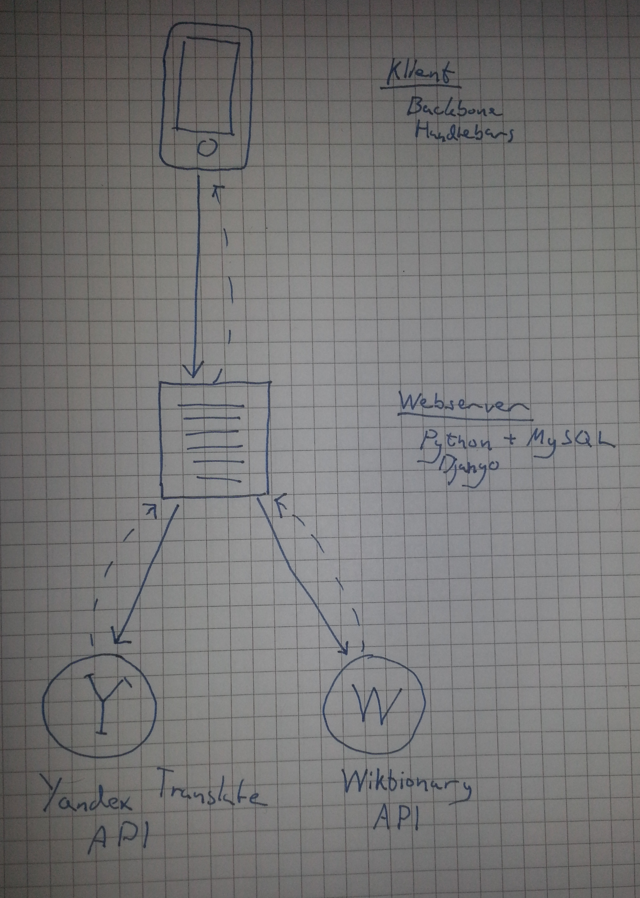

# Inledning / Bakgrund

Vocabool är en persistent ordliste-app. Man kan skapa ordlistor(vokabulär) där
man förvarar ett antal termer med tillhörande definitioner och översättningar.

Jag använder detta framförallt när jag ser på TV-serier, när jag hör ett ord
jag inte förstår så skriver jag in det i appen och lägger till en definition och
en översättning till svenska. Då och då skrollar jag igenom listan och ser om jag
kommer ihåg alla ord. Jag känner att jag lär mig snabbt av detta då jag har en
historik över orden jag lär mig, och dessutom ofta förknippar dem med en scen.

Ett annat användningsområde är att ha en turist-ordlista där man skriver in ord
som "hej", "tack", "mat" osv, och lägger till översättningar till språken som
används i länderna man ska resa till.

# Struktur

# Backend

Serversidan i applikationen utgörs av Python/Django och en MySQL databas. När användaren
först går in på sidan så skickar webbservern ner en konkatenerad och minifierad
JavaScript applikation, som i sin tur sköter all följande kommunikation via
ett REST API. En förfrågan kan se ut som dessa [API exempel][].

Det har visat sig finnas många fördelar med att ha ett så kraftfullt backend-ramverk
som stöd för en så JavaScript-tung applikation, Django Compressor har helt tagit
bort behovet för ett buildstep då den (med debug-läge avstängt) automatiskt
konkatenerar, minifierar och cachar de statiska resurserna.

Trots att det är en JavaScript-applikation så sker i princip all logik på serversidan,
klientapplikationen står bara för presentation och enkel validering och förlitar
sig på REST API:t. För närvarande så visar klientapplikationen felmeddelanden
som kommer från servern, men API:t skickar relevanta statuskoder som gör det lätt
att förbättra den funktionaliteten.

Login och registrering sker helt på serversidan, det håller nere storleken och
komplexiteten på klientapplikationen.

## Tjänster

Definitionerna hämtas från [Wiktionary](http://www.wiktionary.org/), som har extremt
bra och mycket data, lagrad i det mest svårtolkade formatet jag någonsin sett.
I slutändan så var den värd tiden den tog att få [parsningen][Wiktionary parsing] rätt.
Wiktionary kräver ingen nyckel, dock en User-Agent header för varje request.

Översättningarna hämtas från [Yandex Translate](http://translate.yandex.com/),
Yandex är Googles ryska motsvarighet, som tyvärr inte är alls lika bra på översättning
som Google, men har ett väldigt generöst och lättanvänt API - förutsatt att man
kan ta sig förbi captchan med ryska bokstäver.

Data som hämtas från tjänsterna bearbetas och lagras i databasen, när en
användare gjort en sökning så kommer varken sökningen eller bearbetningen av data
att göras igen. För närvarande finns ingen uppdateringsprocess, jag ansåg det vara
lågt prioriterat efter som översättningar och definitioner sällan utsätts för
signifikanta ändringar.

# Client

Klientapplikationen är byggd med Backbone, Handlebars och Bootstrap 3. Backbone har gjort det väldigt
lätt att koppla samman klientapplikationen med REST API:t, och gett ett enkelt
klass-system med begränsat stöd för polymorfism. Det är lätt att tro att Backbone
gör mer än så, då det ofta pratas om som ett _"MVC ramverk"_. Faktum är att man får
göra nästan allting själv, och Backbone gör väldigt lite för att hjälpa till med det.
Dock så ger det en någonstans att börja, och är så pass enkelt uppbyggt att man
inte behöver lägga särskilt mycket tid på att lära sig ramverket. Det har varit
lärorikt och har resulterat i ganska lite onödig kod, men det är också väldigt
lätt att göra fel och det finns få konventioner som hindrar en från att trampa
i fallgropar. Något så enkelt som att ha flera vyer på samma sida, eller att skapa
länkar mellan olika sidor skapar onödigt mycket problem.

# Reflektion

Det känns som detta har varit det mest lärorika projektet hittills, då jag praktiskt
taget lärt mig ett nytt språk, och ett nytt ramverk, något som
jag är väldigt glad att jag gjorde. Python och Django är utan tvekan de trevligaste
teknikerna jag arbetat med.

Jag har dock gjort ett väldigt dåligt jobb när det kommer till planering, jag har
inte haft mycket att visa fram tills sista veckan i projektet. Jag tror att det till
stor del beror på ovana att arbeta med de här teknikerna - det här är första gången
jag skriver ett eget API, och första gången jag använder ett API för att driva
en SPA på klientsidan. Det kändes som att det var svårt att testa utförligt under
projektets gång då både server och klient behövde vara någorlunda funktionsdugliga
för att något skulle fungera.

En SPA ger definitivt ett bättre resultat i slutändan, men det behövs en hel del
mer arbete för att nå dit.

## Vidareutveckling

Det finns mycket som jag fortfarande vill lägga till i applikationen, men jag
har lyckats göra den så pass funktionsduglig att jag nu använder den till det
jag planerat. De mest kritiska funktionerna som saknas är sökning och sortering,
möjligheten att flytta termer mellan vokabulär och att kunna skriva in egen text
på termerna.

Det är stor chans att jag jobbar mer på detta projektet i framtiden då jag
faktiskt använder det själv.

# Risker

**TODO**
Risker med din applikation. Reflektera över vilka risker det finns med din applikation; rent tekniskt, säkerhet, etiskt m.m.

# Betygshöjande

Applikationen är responsiv och webbläsarens framåt/bakåt-knappar fungerar som de ska,
jag tycker också att jag lyckats göra ett ganska bra API som returnerar rätt statuskoder
osv. Trots att detta är första gången jag använder Django i ett riktigt projekt
(och dessutom inte använder det på det "vanliga" sättet) så tycker jag att jag
har använt ramverket på ett bra sätt, jag har tagit till mig de standarder som
finns och projektet är välorganiserat. De externa API:erna som används är inkapslade
i adaptrar som gör det mycket enkelt att byta ut en tjänst mot en annan, om jag
till exempel skulle vilja byta ut Yandex Translate mot Google Translate så kan jag
göra det utan att det påverkar resten av applikationen.

---

# Bilagor

## API exempel

    # Lista alla vokabulär
    /api/vocabulary/

    # Lista alla termer i vokabulär 3
    /api/vocabulary/3/term/

    # Sortera dem efter tidpunkt i fallande ordning
    /api/vocabulary/3/term/?ordering=-timestamp

    # Visar en specifik term (som finns i vokabulär 3)
    /api/vocabulary/3/term/20/

    # Lägger till en definition på term-objektet innan det skickas
    /api/vocabulary/3/term/20/?define

    # Lägger till en översättning på term-objektet innan det skickas
    /api/vocabulary/3/term/20/?translate_to=sv

*Efter att man lagt till en översättning eller definition kommer detta att finnas på objektet även om man inte använder GET-parametern.*

## Wiktionary parsing

En sökning på ordet "kindred":

### Data från Wiktionary

    ==English==

    ===Pronunciation===
    * {{enPR|ˈkĭndrĭd|ˈkĭndrəd}}, {{IPA|/ˈkɪndɹɪd/|/ˈkɪndɹəd/|lang=en}}

    ===Etymology===
    From {{etyl|enm|en}} {{term|kindrede|lang=enm}}, alteration (with epenthetic ''d'') of {{term|kinrede|lang=enm}}, {{term|cunreden|cünreden|kindred|lang=enm}}, from {{etyl|ang|en}} {{term/t|ang|cynrēd}}, {{term|cynrǣden||sc=Latinx|kindred, family, generation, posterity, stock, species|lang=ang}}, from {{term|cynn||kind, sort, quality, race, family, rank, gender|lang=ang}} + {{term|-rǣden||sc=Latinx|condition, state|lang=ang}}, equivalent to {{suffix|kin|red|lang=en}}. More at {{l|en|kin}}.

    ===Noun===
    {{en-noun}}

    # {{context|often|plural only|lang=en}} Distant and close [[relative]]s, collectively. {{rfex}}
    # {{context|often|plural only|lang=en}} Peoples of the same [[ethnic]] [[descent]], not including speaker; [[brethren]]. {{rfex}}
    # {{context|countable|lang=en}} A grouping of relatives.
    #* Shakespeare
    #*: I think there's no man is secure / But the queen's '''kindred'''.

    ====Synonyms====
    * {{sense|people of same ethnic descent}} [[brethren]], [[kinship]]

    ====Translations====
    {{trans-see|kin}}

    {{trans-top|people of same ethnic descent}}
    * Catalan: {{t|ca|saga|f}}
    * Dutch: {{t|nl|soortgenoten}}
    {{trans-mid}}
    * French: {{t+|fr|tribu|f}}
    {{trans-bottom}}

    ===Noun===
    {{en-noun}}

    # A combination of extended family and religious group, of the [[w:Ásatrú|Ásatrú]] religious order in America.

    ====Synonyms====
    * [[Hearth]]
    * [[Garth]]
    * [[Stead]]

    ====External links====
    * [[w:Kindred|Wikipedia article on Ásatrú Kindreds]]

    ===Adjective===
    {{en-adj|-}}

    # Of the same nature.
    #* '''1924''', [[w:Aristotle|Aristotle]], ''[http://www.classicallibrary.org/aristotle/metaphysics/ Metaphysics]'', translated by W. D. Ross, Nashotah, Wisconsin, USA: The Classical Library, 2001, book 1, part 1.
    #*: We have said in the Ethics what the difference is between art and science and the other '''kindred''' faculties;

    ====Translations====
    {{trans-top|of the same nature}}
    * Dutch: {{t+|nl|gelijkaardig}}
    * Portuguese: {{t+|pt|semelhante}}
    {{trans-mid}}
    * Russian: {{t+|ru|родственный|sc=Cyrl}}
    {{trans-bottom}}

    ===Anagrams===
    * [[drinked#English|drinked]]

    [[ang:kindred]]
    [[es:kindred]]
    [[eo:kindred]]
    [[fr:kindred]]
    [[ko:kindred]]
    [[io:kindred]]
    [[it:kindred]]
    [[kn:kindred]]
    [[ku:kindred]]
    [[hu:kindred]]
    [[ml:kindred]]
    [[my:kindred]]
    [[pl:kindred]]
    [[fi:kindred]]
    [[ta:kindred]]
    [[te:kindred]]
    [[chr:kindred]]
    [[tr:kindred]]
    [[vi:kindred]]
    [[zh:kindred]]

### Efter bearbetning

    Distant and close relatives, collectively.
    Peoples of the same ethnic descent, not including speaker; brethren.
    A grouping of relatives.
    A combination of extended family and religious group, of the Ásatrú religious order in America.
    Of the same nature.
